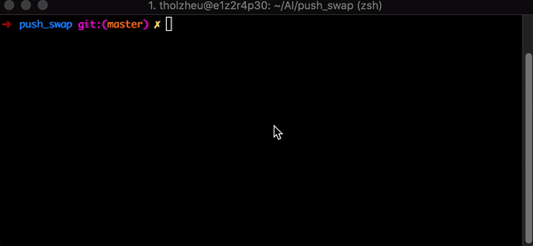

# Push Swap
The Push_swap project is a very simple and highly effective algorithm project. The objective is to sort a list of numbers using two stacks and a limited amount of actions using the least amount of steps possible.

## Game rules
- The game is composed of 2 stacks named a and b
- To start with:
  - a contains a random list of numbers of either positive or negative numbers withour any duplicates
  - b is empty
- The goal is to sort in ascending order numbers into stack a
- To do this you have the following operations at your disposal:
    - **sa :** (swap a) - swap the first 2 elements at the top of stack a
    - **sb :** (swap b) - swap the first 2 elements at the top of stack b
    - **ss :** *sa* and *sb* at the same time
    - **pa :** (push a) - take the first element at the top of b and put it at the top of a
    - **pb :** (push b) - take the first element at the top of a and put it at the top of b
    - **ra :** (rotate a) - shift up all elements of stack a by 1
    - **rb :** (rotate b) - shift up all elements of stack b by 1
    - **rr :** *ra* and *rb* at the same time
    - **rra :** (reverse rotate a) - shift down all elements of stack a by 1
    - **rrb :** (reverse rotate b) - shift down all elements of stack b by 1
    - **rrr :** *rra* and *rrb* at the same time
## How to run
1. Clone the repository and make the executables:
```bash
git clone https://github.com/ThomasH88/push_swap.git
make
```
This will create 2 executables.
  - **push_swap:** takes in a list of numbers as args and outputs to stdout a list of instructions to sort the list
  - **checker:** takes in a list of numbers as args, reads instructions from stdout and tries to sort the list with those instructions. Displays *OK* if sorted correctly and *KO* if not.
2. Launch the program:
  - **Example 1:** Run push_swap alone 
```bash
$>./push_swap 2 1 3 6 5 8
sa
ra
ra
ra
sa
rra
rra
rra
```
  - **Example 2:** Count how many steps it takes and check if it was solved correctly
```bash
$>ARG="2 1 3 6 5 8"; ./push_swap $ARG | wc -l
       8
$>./push_swap $ARG | ./checker $ARG
OK
```
**TIP: If you want to visualize how the sorting is taking place use the -c flag before the list of numbers**
```bash
$>ARG="-c 2 1 3 6 5 8"; ./push_swap $ARG | ./checker $ARG
```


## More info
The details of the project are on push_swap.en.pdf
